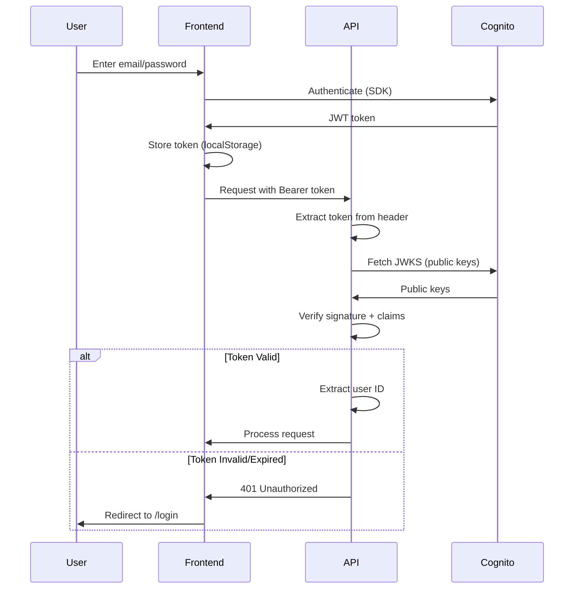

# 11. Backend Architecture

## 11.1 Service Architecture (FastAPI)

**Project Structure:**

```
apps/api/src/
├── main.py                 # FastAPI app entry point
├── config.py               # Environment configuration
├── routes/                 # API route handlers
│   ├── __init__.py
│   ├── auth.py
│   ├── batches.py
│   ├── projects.py
│   ├── templates.py
│   └── export.py
├── services/               # Business logic
│   ├── ai_service.py       # AI generation orchestration
│   ├── validation_service.py
│   ├── export_service.py
│   └── quality_service.py
├── repositories/           # Data access layer
│   ├── user_repository.py
│   ├── batch_repository.py
│   └── project_repository.py
├── models/                 # SQLAlchemy ORM models
│   ├── user.py
│   ├── batch.py
│   └── project.py
├── schemas/                # Pydantic schemas (validation)
│   ├── user.py
│   ├── batch.py
│   └── project.py
├── workers/                # Celery tasks
│   ├── celery_app.py
│   ├── ai_generation_task.py
│   └── export_task.py
├── middleware/             # Custom middleware
│   ├── auth.py
│   ├── rate_limit.py
│   └── error_handler.py
└── utils/                  # Utilities
    ├── logger.py
    ├── s3_client.py
    └── websocket_manager.py
```

---

**FastAPI Entry Point:**

```python
# apps/api/src/main.py
from fastapi import FastAPI
from fastapi.middleware.cors import CORSMiddleware
from socketio import ASGIApp, AsyncServer

from .routes import auth, batches, projects, templates, export
from .middleware import error_handler, rate_limit
from .config import settings

app = FastAPI(
    title="R&D Tax Relief API",
    version="1.0.0",
    docs_url="/docs",
    redoc_url="/redoc"
)

# CORS middleware
app.add_middleware(
    CORSMiddleware,
    allow_origins=[settings.FRONTEND_URL],
    allow_credentials=True,
    allow_methods=["*"],
    allow_headers=["*"]
)

# Custom middleware
app.add_middleware(error_handler.ErrorHandlerMiddleware)
app.add_middleware(rate_limit.RateLimitMiddleware)

# Register routes
app.include_router(auth.router, prefix="/v1/auth", tags=["auth"])
app.include_router(batches.router, prefix="/v1/batches", tags=["batches"])
app.include_router(projects.router, prefix="/v1/projects", tags=["projects"])
app.include_router(templates.router, prefix="/v1/templates", tags=["templates"])
app.include_router(export.router, prefix="/v1/export", tags=["export"])

# WebSocket server
sio = AsyncServer(async_mode='asgi', cors_allowed_origins='*')
socket_app = ASGIApp(sio, app)

@sio.event
async def connect(sid, environ, auth):
    # Validate JWT token from query params
    token = auth.get('token')
    # ... validate token, join batch room
    pass

@sio.event
async def disconnect(sid):
    pass

# Health check
@app.get("/health")
async def health():
    return {"status": "healthy", "version": "1.0.0"}
```

---

## 11.2 Database Architecture

**Repository Pattern:**

```python
# apps/api/src/repositories/batch_repository.py
from sqlalchemy.ext.asyncio import AsyncSession
from sqlalchemy import select, update
from typing import List, Optional
from uuid import UUID

from ..models.batch import Batch

class BatchRepository:
    def __init__(self, session: AsyncSession):
        self.session = session

    async def create(self, user_id: UUID, name: str, total_projects: int) -> Batch:
        batch = Batch(
            user_id=user_id,
            name=name,
            total_projects=total_projects
        )
        self.session.add(batch)
        await self.session.commit()
        await self.session.refresh(batch)
        return batch

    async def get_by_id(self, batch_id: UUID) -> Optional[Batch]:
        result = await self.session.execute(
            select(Batch).where(Batch.id == batch_id)
        )
        return result.scalar_one_or_none()

    async def list_by_user(
        self,
        user_id: UUID,
        limit: int = 10,
        offset: int = 0
    ) -> List[Batch]:
        result = await self.session.execute(
            select(Batch)
            .where(Batch.user_id == user_id, Batch.status != 'archived')
            .order_by(Batch.created_at.desc())
            .limit(limit)
            .offset(offset)
        )
        return result.scalars().all()

    async def update_status(self, batch_id: UUID, status: str) -> None:
        await self.session.execute(
            update(Batch)
            .where(Batch.id == batch_id)
            .values(status=status)
        )
        await self.session.commit()
```

---

## 11.3 Authentication and Authorization

**AWS Cognito Integration:**

```python
# apps/api/src/middleware/auth.py
import jwt
from fastapi import HTTPException, Depends
from fastapi.security import HTTPBearer, HTTPAuthCredentials
import requests

from ..config import settings

security = HTTPBearer()

async def verify_jwt_token(credentials: HTTPAuthCredentials = Depends(security)) -> dict:
    token = credentials.credentials

    # Get Cognito public keys
    jwks_url = f"https://cognito-idp.{settings.AWS_REGION}.amazonaws.com/{settings.COGNITO_USER_POOL_ID}/.well-known/jwks.json"
    jwks = requests.get(jwks_url).json()

    try:
        # Decode and verify token
        unverified_header = jwt.get_unverified_header(token)
        rsa_key = {}
        for key in jwks["keys"]:
            if key["kid"] == unverified_header["kid"]:
                rsa_key = {
                    "kty": key["kty"],
                    "kid": key["kid"],
                    "use": key["use"],
                    "n": key["n"],
                    "e": key["e"]
                }

        if rsa_key:
            payload = jwt.decode(
                token,
                rsa_key,
                algorithms=["RS256"],
                audience=settings.COGNITO_CLIENT_ID,
                issuer=f"https://cognito-idp.{settings.AWS_REGION}.amazonaws.com/{settings.COGNITO_USER_POOL_ID}"
            )
            return payload
        else:
            raise HTTPException(status_code=401, detail="Invalid token")
    except jwt.ExpiredSignatureError:
        raise HTTPException(status_code=401, detail="Token expired")
    except jwt.JWTClaimsError:
        raise HTTPException(status_code=401, detail="Invalid claims")
    except Exception:
        raise HTTPException(status_code=401, detail="Invalid token")

async def get_current_user(token_payload: dict = Depends(verify_jwt_token)) -> str:
    return token_payload["sub"]  # Cognito user ID
```

**Auth Flow Diagram:**



---
