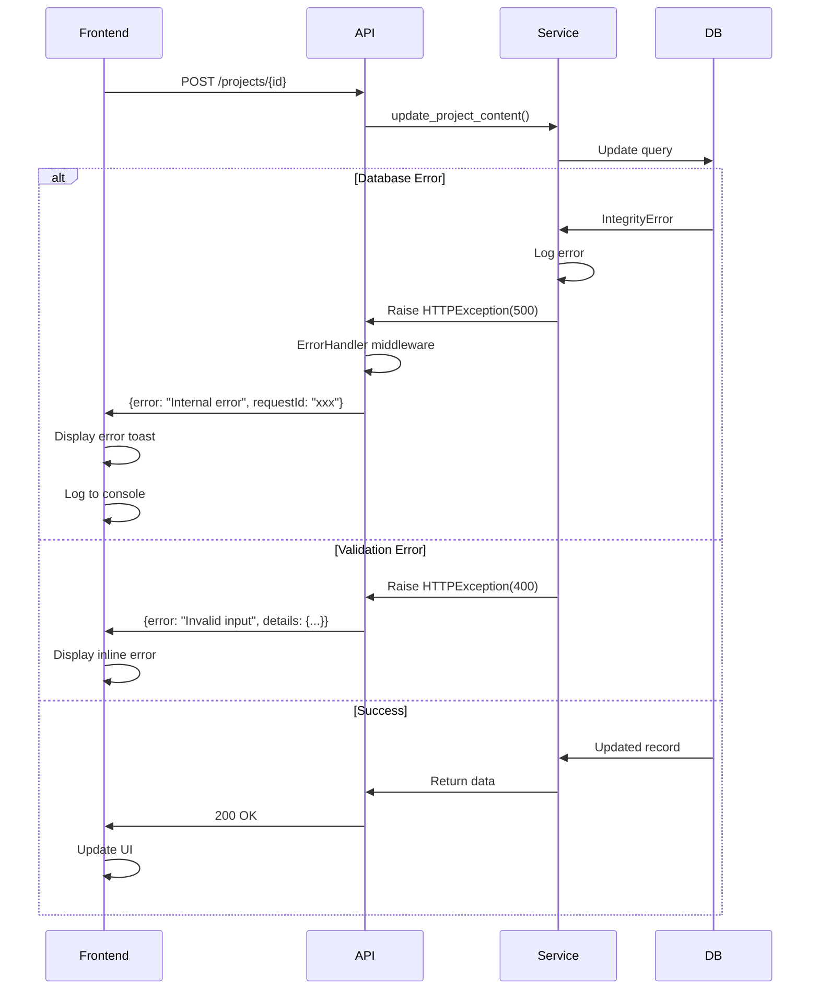

# 18. Error Handling Strategy

## 18.1 Error Flow



---

## 18.2 Error Response Format

**Standard Error Response:**

```typescript
interface ApiError {
  error: {
    code: string;           // 'validation_error' | 'internal_error' | 'not_found'
    message: string;        // Polish user-facing message
    details?: Record<string, any>; // Field-level errors for forms
    timestamp: string;
    requestId: string;      // For support/debugging
  };
}
```

**Example:**

```json
{
  "error": {
    "code": "validation_error",
    "message": "Błędy walidacji w pliku Excel",
    "details": {
      "row2": {
        "opis": "Opis musi mieć co najmniej 100 znaków"
      },
      "row5": {
        "dataZakonczenia": "Data zakończenia musi być późniejsza niż data rozpoczęcia"
      }
    },
    "timestamp": "2025-10-22T14:30:00Z",
    "requestId": "req_abc123"
  }
}
```

---

## 18.3 Frontend Error Handling

```typescript
// apps/web/src/services/api.ts (interceptor)
api.interceptors.response.use(
  (response) => response,
  (error) => {
    const apiError = error.response?.data?.error;

    // Log to console for debugging
    console.error('[API Error]', {
      code: apiError?.code,
      message: apiError?.message,
      requestId: apiError?.requestId,
      url: error.config?.url
    });

    // Show user-friendly toast notification
    if (apiError?.message) {
      toast.error(apiError.message);
    } else {
      toast.error('Wystąpił nieoczekiwany błąd. Spróbuj ponownie.');
    }

    return Promise.reject(error);
  }
);
```

---

## 18.4 Backend Error Handling

```python
# apps/api/src/middleware/error_handler.py
from fastapi import Request, HTTPException
from fastapi.responses import JSONResponse
import logging
import uuid

logger = logging.getLogger(__name__)

async def error_handler_middleware(request: Request, call_next):
    request_id = str(uuid.uuid4())

    try:
        response = await call_next(request)
        return response
    except HTTPException as exc:
        # Expected errors
        return JSONResponse(
            status_code=exc.status_code,
            content={
                "error": {
                    "code": exc.detail.get("code", "http_error"),
                    "message": exc.detail.get("message", str(exc.detail)),
                    "details": exc.detail.get("details"),
                    "timestamp": datetime.utcnow().isoformat(),
                    "requestId": request_id
                }
            }
        )
    except Exception as exc:
        # Unexpected errors
        logger.exception(f"Unhandled exception: {exc}", extra={"requestId": request_id})
        return JSONResponse(
            status_code=500,
            content={
                "error": {
                    "code": "internal_error",
                    "message": "Wystąpił błąd serwera. Skontaktuj się z pomocą techniczną.",
                    "timestamp": datetime.utcnow().isoformat(),
                    "requestId": request_id
                }
            }
        )
```

---
