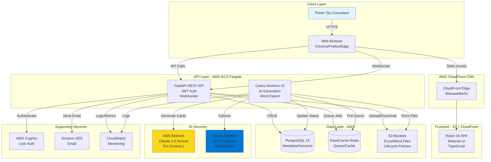

# 2. High Level Architecture

## 2.1 Technical Summary

The R&D Tax Relief Project Card Generator employs a **modern serverless-hybrid fullstack architecture** deployed primarily on AWS infrastructure within the EU-Central-1 region. The system features a **React 18 TypeScript SPA frontend** with Material-UI components, communicating with a **Python FastAPI backend** that orchestrates batch processing through Celery workers and Redis queue management. The architecture integrates **AWS Bedrock (Claude 3.5 Sonnet)** as the primary AI engine with **Azure OpenAI (GPT-4)** as a failover, ensuring resilient Polish-language project card generation. **PostgreSQL** stores metadata and session data, while **AWS S3** handles file storage with automated lifecycle policies for GDPR compliance. The system achieves real-time batch status updates through WebSocket connections, processes up to 5 concurrent AI requests, and exports government-compliant Word documents using python-docx, delivering a complete end-to-end workflow from Excel upload to downloadable .docx files in under 30 minutes for 20-project batches.

## 2.2 Platform and Infrastructure Choice

**Platform:** AWS (EU-Central-1 Frankfurt, Germany)

**Key Services:**
- **Compute:** ECS Fargate (backend API + Celery workers)
- **AI:** AWS Bedrock (Claude 3.5 Sonnet primary), Azure OpenAI Service (GPT-4 fallback)
- **Database:** RDS PostgreSQL 15+
- **Cache/Queue:** ElastiCache Redis 7+
- **Storage:** S3 (with lifecycle policies for GDPR compliance)
- **CDN:** CloudFront (frontend static assets)
- **Auth:** AWS Cognito User Pools
- **Monitoring:** CloudWatch (logs, metrics, dashboards, alerts)
- **Email:** Amazon SES (password reset, notifications)

**Deployment Host and Regions:**
- **Primary Region:** AWS EU-Central-1 (Frankfurt, Germany) - All data processing
- **Failover AI:** Azure West Europe (Netherlands) - GPT-4 fallback only
- **CDN Edge Locations:** CloudFront (Warsaw, Berlin, Amsterdam for low latency to Poland)

**Rationale:** AWS-centric approach chosen because AWS Bedrock is a hard requirement for Claude 3.5 Sonnet with EU data residency. Keeping all infrastructure on one cloud simplifies networking, IAM, monitoring, and GDPR compliance.

## 2.3 Repository Structure

**Structure:** Monorepo (single repository)

**Monorepo Tool:** npm workspaces (lightweight, no additional tooling)

**Package Organization:**
```
apps/
  web/          # React frontend application
  api/          # FastAPI backend application
packages/
  shared/       # Shared TypeScript types and constants
  config/       # Shared ESLint, TypeScript, Jest config
```

**Rationale:** Monorepo enables sharing TypeScript types between frontend and backend, simplified versioning, and coordinated deployment. npm workspaces sufficient for this project size (vs Nx/Turborepo overhead).

## 2.4 High Level Architecture Diagram



## 2.5 Architectural Patterns

**Overall Architecture:**
- **Jamstack + Async Processing:** Static frontend with serverless API and background workers - _Rationale:_ Optimal performance for Polish users (CDN edge caching) while handling long-running AI generation asynchronously

**Frontend Patterns:**
- **Component-Based UI:** React components with TypeScript and Atomic Design - _Rationale:_ Maintainability and reusability across 5 core screens
- **Container/Presenter Pattern:** Smart containers handle logic, presentational components handle UI - _Rationale:_ Clear separation of concerns, easier testing
- **React Query for Server State:** Manage API state, caching, real-time updates - _Rationale:_ Eliminates Redux boilerplate, built-in cache invalidation

**Backend Patterns:**
- **Repository Pattern:** Abstract data access logic - _Rationale:_ Testability and future database migration flexibility
- **Task Queue Pattern:** Celery + Redis for async batch processing - _Rationale:_ Essential for 5 concurrent AI requests without blocking
- **Circuit Breaker Pattern:** Failover from Bedrock → Azure OpenAI on failures - _Rationale:_ Resilience against AI service outages
- **Retry with Exponential Backoff:** 3 retry attempts for failed AI calls - _Rationale:_ Handle transient API failures

**Integration Patterns:**
- **Backend for Frontend (BFF):** FastAPI orchestrates between React and AI services - _Rationale:_ Simplifies frontend complexity
- **API Gateway Pattern:** Single entry point with centralized auth, rate limiting, CORS - _Rationale:_ Security and monitoring chokepoint

---
