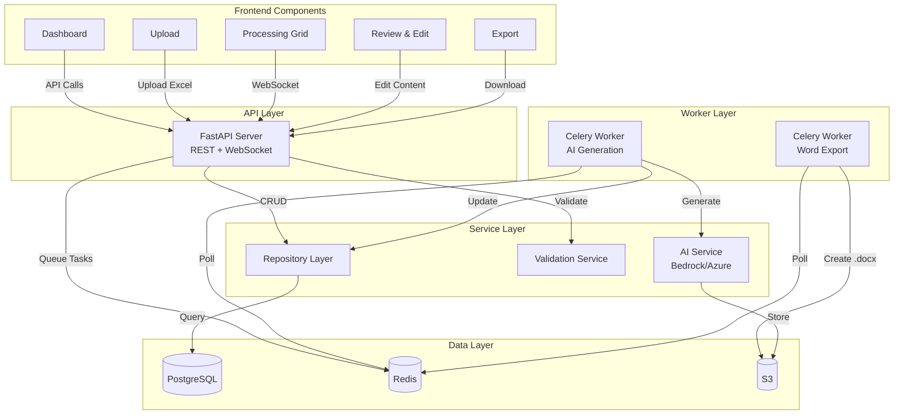

# 6. Components

## Frontend Components

**Core UI Components:**

1. **Dashboard Component**
   - Responsibility: Display recent batches, initiate new batch
   - Key Interfaces: BatchList, BatchCard, NewBatchButton
   - Dependencies: React Query (batch fetching), React Router
   - Tech: React 18, MUI DataGrid, Axios

2. **Upload Component**
   - Responsibility: Excel upload with drag-and-drop, validation display
   - Key Interfaces: FileDropzone, ValidationErrorList
   - Dependencies: react-dropzone, SheetJS, Zod validator
   - Tech: React, MUI, Tailwind

3. **Processing Grid Component**
   - Responsibility: Real-time batch processing visualization
   - Key Interfaces: ProjectStatusCard, ProgressIndicator, WebSocketManager
   - Dependencies: Socket.IO client, React Query
   - Tech: React, MUI Grid, Socket.IO

4. **Review & Edit Component**
   - Responsibility: Section-by-section content review and editing
   - Key Interfaces: SectionEditor (TipTap), QualityScoreBadge, RegenerateButton
   - Dependencies: TipTap editor, React Query mutations
   - Tech: React, TipTap, MUI

5. **Export Component**
   - Responsibility: Single/batch Word export with download
   - Key Interfaces: ExportButton, DownloadProgress
   - Dependencies: Axios (file download)
   - Tech: React, MUI

---

## Backend Components

**Core Backend Services:**

1. **API Server (FastAPI)**
   - Responsibility: REST endpoints, WebSocket server, authentication
   - Key Interfaces: RESTful routes, WebSocket handlers
   - Dependencies: PostgreSQL (SQLAlchemy), Redis, Cognito
   - Tech: FastAPI, Uvicorn, Socket.IO

2. **Celery Worker - AI Generation**
   - Responsibility: Execute AI generation tasks (5 concurrent)
   - Key Interfaces: GenerateProjectTask, AWS Bedrock client, Azure OpenAI client
   - Dependencies: Redis queue, PostgreSQL, S3
   - Tech: Celery, boto3, openai SDK

3. **Celery Worker - Word Export**
   - Responsibility: Generate .docx files from ProjectContent
   - Key Interfaces: ExportProjectTask, python-docx
   - Dependencies: PostgreSQL, S3
   - Tech: Celery, python-docx

4. **Repository Layer**
   - Responsibility: Abstract database access
   - Key Interfaces: UserRepository, BatchRepository, ProjectRepository
   - Dependencies: PostgreSQL
   - Tech: SQLAlchemy ORM, async sessions

5. **AI Service Layer**
   - Responsibility: Orchestrate multi-stage AI generation with circuit breaker
   - Key Interfaces: AIGenerationService, PromptBuilder, QualityScorer
   - Dependencies: AWS Bedrock, Azure OpenAI
   - Tech: boto3, openai SDK, retry logic

6. **Validation Service**
   - Responsibility: Excel validation, Polish grammar checking
   - Key Interfaces: ExcelValidator, LanguageToolClient
   - Dependencies: openpyxl, LanguageTool API
   - Tech: Python, Pydantic, LanguageTool

---

## Component Diagram

---
