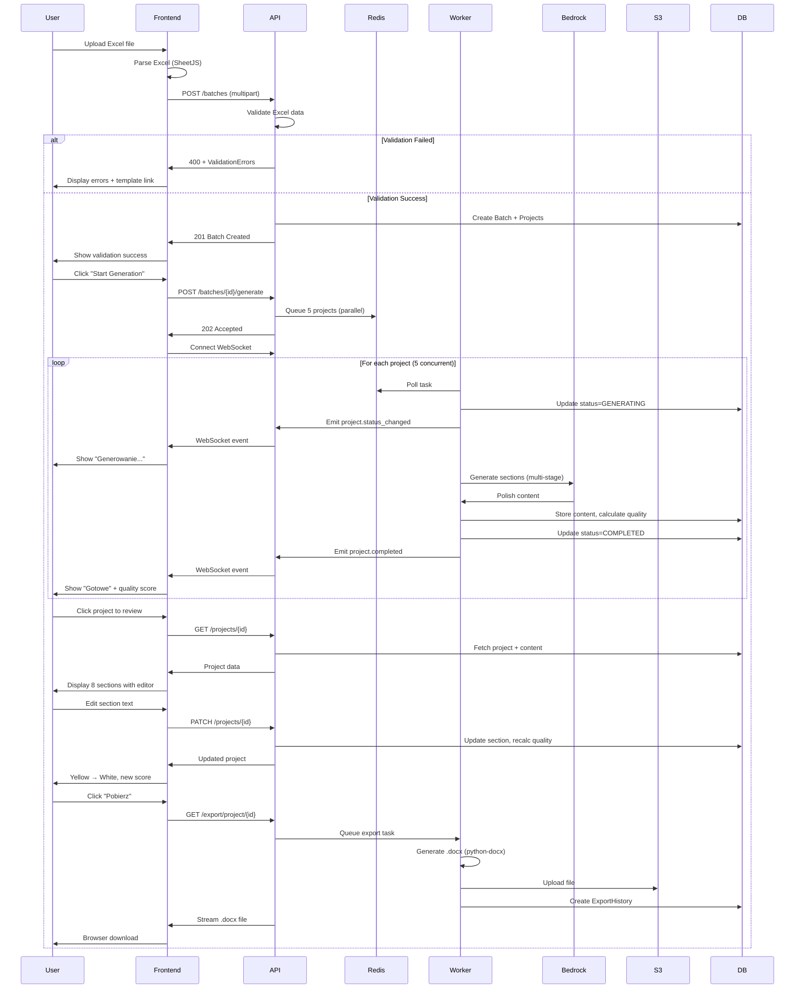
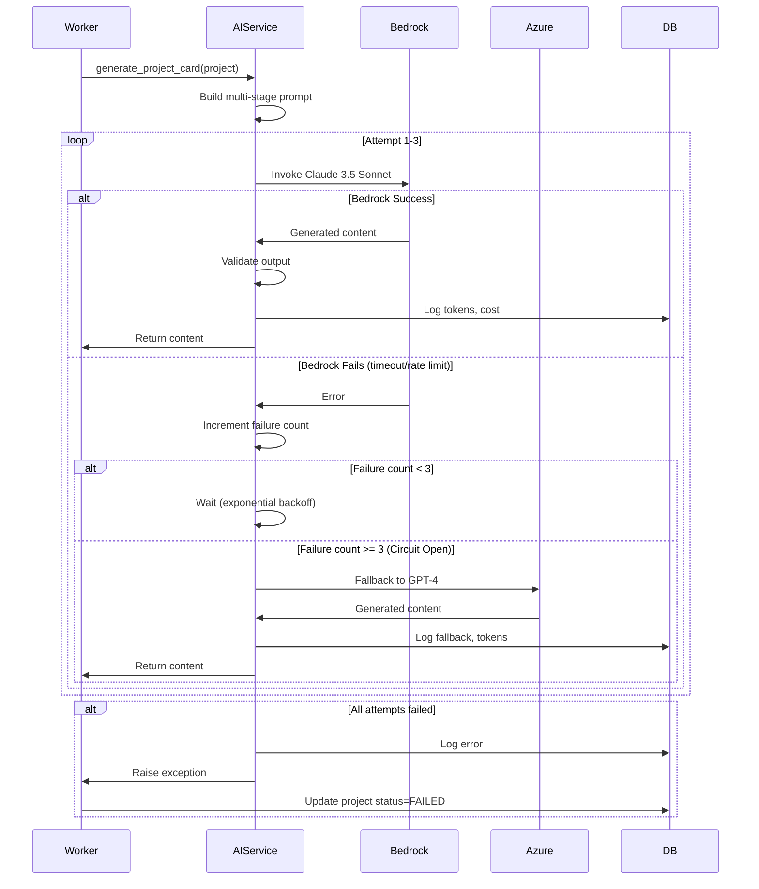
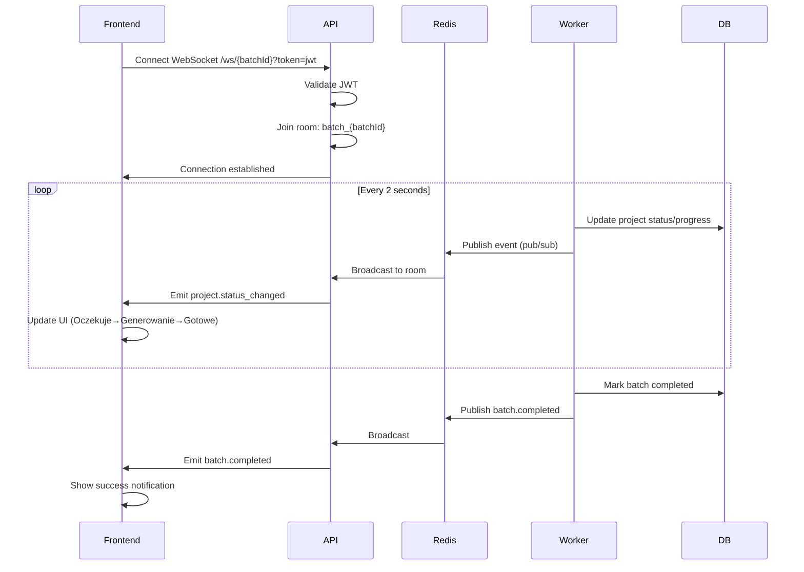

# 8. Core Workflows

## Workflow 1: Complete Batch Processing Flow

```mermaid
sequenceDiagram
    participant User
    participant Frontend
    participant API
    participant Redis
    participant Worker
    participant Bedrock
    participant S3
    participant DB

    User->>Frontend: Upload Excel file
    Frontend->>Frontend: Parse Excel (SheetJS)
    Frontend->>API: POST /batches (multipart)
    API->>API: Validate Excel data
    alt Validation Failed
        API->>Frontend: 400 + ValidationErrors
        Frontend->>User: Display errors + template link
    else Validation Success
        API->>DB: Create Batch + Projects
        API->>Frontend: 201 Batch Created
        Frontend->>User: Show validation success

        User->>Frontend: Click "Start Generation"
        Frontend->>API: POST /batches/{id}/generate
        API->>Redis: Queue 5 projects (parallel)
        API->>Frontend: 202 Accepted

        Frontend->>API: Connect WebSocket

        loop For each project (5 concurrent)
            Worker->>Redis: Poll task
            Worker->>DB: Update status=GENERATING
            Worker->>API: Emit project.status_changed
            API->>Frontend: WebSocket event
            Frontend->>User: Show "Generowanie..."

            Worker->>Bedrock: Generate sections (multi-stage)
            Bedrock->>Worker: Polish content
            Worker->>DB: Store content, calculate quality
            Worker->>DB: Update status=COMPLETED
            Worker->>API: Emit project.completed
            API->>Frontend: WebSocket event
            Frontend->>User: Show "Gotowe" + quality score
        end

        User->>Frontend: Click project to review
        Frontend->>API: GET /projects/{id}
        API->>DB: Fetch project + content
        API->>Frontend: Project data
        Frontend->>User: Display 8 sections with editor

        User->>Frontend: Edit section text
        Frontend->>API: PATCH /projects/{id}
        API->>DB: Update section, recalc quality
        API->>Frontend: Updated project
        Frontend->>User: Yellow → White, new score

        User->>Frontend: Click "Pobierz"
        Frontend->>API: GET /export/project/{id}
        API->>Worker: Queue export task
        Worker->>Worker: Generate .docx (python-docx)
        Worker->>S3: Upload file
        Worker->>DB: Create ExportHistory
        API->>Frontend: Stream .docx file
        Frontend->>User: Browser download
    end
```

---

## Workflow 2: AI Generation with Failover

```mermaid
sequenceDiagram
    participant Worker
    participant AIService
    participant Bedrock
    participant Azure
    participant DB

    Worker->>AIService: generate_project_card(project)
    AIService->>AIService: Build multi-stage prompt

    loop Attempt 1-3
        AIService->>Bedrock: Invoke Claude 3.5 Sonnet
        alt Bedrock Success
            Bedrock->>AIService: Generated content
            AIService->>AIService: Validate output
            AIService->>DB: Log tokens, cost
            AIService->>Worker: Return content
        else Bedrock Fails (timeout/rate limit)
            Bedrock->>AIService: Error
            AIService->>AIService: Increment failure count

            alt Failure count < 3
                AIService->>AIService: Wait (exponential backoff)
            else Failure count >= 3 (Circuit Open)
                AIService->>Azure: Fallback to GPT-4
                Azure->>AIService: Generated content
                AIService->>DB: Log fallback, tokens
                AIService->>Worker: Return content
            end
        end
    end

    alt All attempts failed
        AIService->>DB: Log error
        AIService->>Worker: Raise exception
        Worker->>DB: Update project status=FAILED
    end
```

---

## Workflow 3: Real-Time Status Updates

```mermaid
sequenceDiagram
    participant Frontend
    participant API
    participant Redis
    participant Worker
    participant DB

    Frontend->>API: Connect WebSocket /ws/{batchId}?token=jwt
    API->>API: Validate JWT
    API->>API: Join room: batch_{batchId}
    API->>Frontend: Connection established

    loop Every 2 seconds
        Worker->>DB: Update project status/progress
        Worker->>Redis: Publish event (pub/sub)
        Redis->>API: Broadcast to room
        API->>Frontend: Emit project.status_changed
        Frontend->>Frontend: Update UI (Oczekuje→Generowanie→Gotowe)
    end

    Worker->>DB: Mark batch completed
    Worker->>Redis: Publish batch.completed
    Redis->>API: Broadcast
    API->>Frontend: Emit batch.completed
    Frontend->>Frontend: Show success notification
```

---
