```mermaid
graph TD
    Start([Batch completes with failures]) --> Results[Results: ✅ 13 Success, ❌ 2 Failed]
    Results --> ReviewFailures[Click on failed project to see details]
    ReviewFailures --> ErrorDetails[Error: Missing required field - Cel projektu]

    ErrorDetails --> ChooseAction{How to fix?}
    ChooseAction -->|Fix in place| EditData[Click Edit Data inline]
    ChooseAction -->|Export and fix in Excel| ExportFailed[Click Export Failed Projects]

    EditData --> UpdateField[Update missing field in form]
    UpdateField --> RetryOne[Click Retry This Project]

    ExportFailed --> DownloadExcel[Download RD_Failed_Projects_Batch47.xlsx]
    DownloadExcel --> OpenExcel[Open in Excel, see error annotations]
    OpenExcel --> FixInExcel[Fix data: add missing Cel projektu]
    FixInExcel --> ReUpload[Upload fixed Excel file]

    ReUpload --> ValidateFixes[Validation checks fixes]
    ValidateFixes --> AllFixed{All errors resolved?}
    AllFixed -->|Yes| GenerateFailed[Generate 2 fixed projects]
    AllFixed -->|No| ErrorDetails

    RetryOne --> GenerateFailed
    GenerateFailed --> ProcessingRetry[Processing 2 projects]
    ProcessingRetry --> RetryResults[Results: ✅ 2 Success]

    RetryResults --> MergeResults[Batch #47 now shows: ✅ 15 Success total]
    MergeResults --> DownloadAll[Download All 15 Cards ZIP]
    DownloadAll --> End([Complete batch delivered])
```

# R&D Tax Relief Project Card Generation System UI/UX Specification

## Introduction

This document defines the user experience goals, information architecture, user flows, and visual design specifications for the R&D Tax Relief Project Card Generation System's user interface. It serves as the foundation for visual design and frontend development, ensuring a cohesive and user-centered experience.

### Overall UX Goals & Principles

#### Target User Personas

**MVP Primary Persona: The Efficiency-Focused Tax Consultant**
- **Profile:** Professional R&D tax consultant (solo practitioner or small firm), handles 5-50 clients annually
- **Context:** Works from office desktop during business hours; occasionally laptop from home during peak tax season
- **Pain Points:** Time pressure during tax season, repetitive documentation work, quality consistency challenges
- **Goals:** Reduce documentation time by 70-80%, maintain professional quality, scale practice without increasing labor hours
- **Tech Savviness:** Comfortable with Excel (formulas, data validation), Word, and web applications; values simplicity over advanced features

**MVP Secondary Persona: The Quality Guardian**
- **Profile:** Senior consultant or firm partner responsible for final document approval
- **Context:** Reviews batches of documents, often under time pressure
- **Pain Points:** Need to review AI outputs quickly but thoroughly, ensure compliance, protect firm reputation
- **Goals:** Fast review workflows, clear quality indicators, easy editing capabilities
- **Tech Savviness:** Similar to primary persona, prioritizes reliability and trust

**Post-MVP Future Persona: The Inbound Accountant (Knowledge Gap User)**
- **Profile:** In-house accountant or tax manager at construction/engineering company with no R&D tax relief expertise
- **Pain Points:** Doesn't understand Ulga B+R requirements, unsure what project data is needed, fears making mistakes
- **Goals:** Learn what's required, gather correct information from technical teams, produce compliant documentation without external consultant costs
- **Tech Savviness:** Strong with accounting software and Excel, but needs guidance for unfamiliar processes
- **MVP Note:** Not a primary design driver for MVP, but design should avoid assumptions that would prevent future support (e.g., don't assume deep R&D knowledge in UI copy)

**Edge Case Considerations:**
- **First-Time User:** Needs quick-start onboarding (tutorial or guided first use)
- **Bulk Power User:** Processing 50+ projects in single session
- **Constrained Connection User:** Working with slower internet or large Excel files

#### Usability Goals

1. **Immediate Productivity:** New users can successfully generate their first batch of project cards within 10 minutes
   - *Assumes:* Basic Excel skills, quick-start guide available, stable internet connection, <20 projects in first batch

2. **Efficiency at Scale:** Consultants can process 20+ projects in a single 15-minute session (upload → generation → download, excluding detailed review time)
   - *Metric:* Average time per document generation ≤45 seconds

3. **Error Prevention & Recovery:**
   - Clear validation prevents submission of incomplete/invalid Excel files before processing
   - Failed generations can be retried in <30 seconds with clear error messaging

4. **Trust Through Transparency:**
   - AI generation progress visible with estimated time remaining
   - Quality indicators help prioritize review focus
   - Show confidence scores or flags for sections requiring attention

5. **Fast Review Workflow:** Consultants can identify high-priority sections requiring attention within 2 minutes per document
   - Visual highlighting of flagged sections
   - Quick navigation between quality issues

6. **Business Impact:** Enable 2-3x project throughput without quality degradation

#### Design Principles

**Priority-Ordered Principles (for conflict resolution):**

1. **Speed is Priority One** - Minimize clicks, loading states, and waiting time; when speed conflicts with other principles, speed wins
   - Single-page upload with drag-and-drop
   - Batch processing without page reloads
   - Instant download when generation complete

2. **Clarity Over Cleverness** - Use standard UI patterns; clear labels over icons; explicit over implicit
   - Familiar Material-UI components
   - Plain language labels ("Upload Excel File" not "Import Data")
   - No hidden features or Easter eggs

3. **Progressive Disclosure** - Three-step workflow (Upload → Generate → Review); advanced features hidden until needed
   - Main workflow always visible
   - Settings/preferences in secondary menu
   - Help available but not intrusive

4. **Earn Trust Through Transparency** - Show progress, expose quality scores, but don't slow down core workflow
   - Progress indicators during AI generation
   - Quality scores displayed but not blocking
   - Ability to inspect AI decisions (optional, advanced)

5. **Professional = Simple + Reliable** - Clean Material-UI design, consistent spacing, no visual gimmicks
   - Material-UI default theme with minimal customization
   - Consistent 8px spacing grid
   - Professional color palette (blues, grays - avoid bright/playful colors)
   - Reliable error handling and graceful degradation

**Design Decision Protocol:**
When design principles conflict, resolve in priority order: **Speed > Clarity > Transparency > Polish**

#### Change Log

| Date | Version | Description | Author |
|------|---------|-------------|--------|
| 2025-10-22 | 1.0 | Initial UX goals and principles defined | Sally (UX Expert) |

---

## Information Architecture (IA)

### Site Map / Screen Inventory


### Navigation Structure

**Primary Navigation (Top Bar):**
- Logo/Home (returns to Main Dashboard)
- **"Download Template" button** (always accessible - downloads standardized Excel template with version number)
- "New Batch" button (quick access to Upload Excel)
- "History" (access to Generation History)
- User menu (Account Settings, Logout)

**Secondary Navigation (Contextual):**
- **During Processing:** Progress bar showing: "Processing project 5 of 18... (estimated 3 minutes remaining)" with overall batch progress
- **In Review Mode:**
  - Document carousel navigation: "← Card 1 of 18 →"
  - Thumbnail sidebar showing all cards in batch with quality indicators
  - Section jump links within current document
- **In History:** Filter/search by batch date, project names, status

**Breadcrumb Strategy:**
- Show current location and allow quick navigation back
- Example: `Dashboard > Batch #47 (18 projects) > Processing > Review: Card 5 of 18`
- Clickable breadcrumb trail for returning to previous steps

### Excel Template Structure

**Template File:** `RD_Tax_Relief_Template_v1.0.xlsx`

**Template Includes:**

1. **Projects Sheet (Main Data Entry):**
   - Pre-configured columns with validation rules:
     - **Nazwa projektu** (Project Name) - Required, text, max 200 characters
     - **Opis** (Description) - Required, text, min 50 characters
     - **Data rozpoczęcia** (Start Date) - Required, date format (YYYY-MM-DD)
     - **Data zakończenia** (End Date) - Required, date format (YYYY-MM-DD)
     - **Cel projektu** (Project Goal) - Required, text, max 500 characters
     - **Osoba odpowiedzialna** (Responsible Person) - Required, text
   - Data validation built into cells (date pickers, character limits)
   - Conditional formatting highlighting incomplete rows
   - **Hidden metadata cell** containing template version (for version checking on upload)

2. **Instructions Sheet (Separate Tab):**
   - Field-by-field explanation in Polish
   - Examples of good vs. poor data entry
   - Common mistakes and how to avoid them
   - Tips for gathering data from technical teams

3. **Example Row:**
   - Pre-filled sample project showing proper format
   - User can duplicate and modify for their projects

**Template Versioning:**
- Version number in filename and embedded in hidden cell
- Upload validation checks template version
- Notification if outdated: "You're using template v1.0. Download latest v1.2 for improved validation."

**Compatibility Note:**
- Optimized for Microsoft Excel 2016+
- Limited compatibility with Google Sheets (data validation may not work)
- LibreOffice Calc supported with reduced validation features

### Single Excel → Multiple Cards Workflow

**Batch Size Constraints:**
- **Maximum: 20 projects per upload** (aligns with typical consultant workload per client)
- If Excel contains >20 projects, show error: "Your file contains 35 projects. Please split into multiple batches (max 20 per upload)."
- **Minimum: 1 project** (though batch processing optimized for 5+ projects)

**Upload Screen Features:**

1. **Prominent Template Download Section:**
   - Large "Download Excel Template" button at top
   - Version indicator: "Template v1.0"
   - Tooltip: "Use this template to ensure your data is correctly formatted and validated"
   - Link to template user guide (PDF/video)

2. **File Upload Area:**
   - Drag-and-drop zone with visual feedback
   - "Browse Files" button alternative
   - Accepted format note: "Upload Excel file (.xlsx) with 1-20 projects"
   - File size limit: 10MB

3. **File Validation (Automatic after upload):**
   - Check template version
   - Validate file structure (correct columns, sheet names)
   - Check data types and required fields
   - Detect duplicate project names (warning, not blocking)
   - Show validation results immediately

4. **Projects Preview Table:**
   - Displays **all detected projects** from Excel
   - Columns: ☑️ Select | Project Name | Description Preview (50 chars) | Date Range | Status
   - Status indicators:
     - ✅ **Valid** (green) - Ready to generate
     - ⚠️ **Warning** (yellow) - Minor issues, can proceed
     - ❌ **Invalid** (red) - Must fix before generation
   - **Checkboxes** to select/deselect individual projects
   - "Select All" / "Deselect All" / "Select Only Valid" actions
   - Sortable by any column
   - Inline error messages for invalid rows
   - **Action buttons:**
     - "Generate Selected (14 of 18)" - Primary action, disabled if none selected
     - "Back to Upload" - Replace file
     - "Fix in Excel" - Download corrected template with current data + error annotations

5. **Batch Processing:**
   - Processes up to **5 projects in parallel**, queues remainder
   - Real-time progress: "Processing... 5 of 18 complete (estimated 3 minutes remaining)"
   - Individual progress bars for currently processing projects
   - Each card generated independently (if one fails, others continue)
   - Polling every 2 seconds for status updates (WebSockets in post-MVP)

6. **Results Overview (Batch Summary):**
   - Hero metrics at top:
     - ✅ **14 Successful** | ⚠️ **2 Warnings** | ❌ **2 Failed**
   - **Success Summary Table:**
     - Project Name | Quality Score | Generated Date | Actions (Review | Download)
     - Sort by quality score (lowest first) to prioritize review
   - **Failed Projects Section:**
     - Project Name | Error Message | Actions (View Details | Edit Data | Retry)
     - **"Export Failed Projects to Excel"** button - Creates new template with failed rows + error column
   - **Bulk Actions:**
     - "Download All Successful (14 cards)" - ZIP file
     - "Retry Failed Projects" - Re-queue only failed ones
     - "Download Summary Report" - CSV/Excel with batch results

7. **Review Carousel (for successful generations):**
   - Navigate through cards: "← Previous | Card 5 of 14 | Next →"
   - Left sidebar: Thumbnail list with quality scores
   - Main area: Document preview with section navigation
   - Right panel: Quality indicators and flagged sections
   - Actions: Download This Card | Flag for Revision | Mark as Reviewed

8. **Download Center:**
   - **Bulk Download (ZIP):**
     - Filename: `RD_Cards_Batch47_2025-10-22.zip`
     - Contains all successful cards
     - Individual files named: `{Project_Name}_Card.docx` (sanitized)
   - **Individual Downloads:**
     - One-click download per card
   - **Summary Report:**
     - CSV/Excel file with: Project Name | Status | Quality Score | Generated Date | Filename
     - Useful for record-keeping and audit trail

### Failed Project Recovery Workflow

**Scenario:** User uploads 18 projects, 3 fail due to insufficient data.

**Recovery Path:**
1. Results screen shows **3 failed projects** with specific error messages
2. User clicks **"Export Failed Projects to Excel"**
3. System generates new Excel file:
   - Contains only the 3 failed rows
   - Adds "Error Details" column explaining what's missing
   - Preserves template validation
   - Filename: `RD_Failed_Projects_Batch47.xlsx`
4. User fixes data in Excel, re-uploads
5. System processes only those 3 projects
6. Results merged with original batch in History view

### Batch Processing Technical Specifications

**AI Concurrency Control:**
- **5 parallel API calls maximum** to Claude/GPT-4
- Remaining projects queued via Celery task queue
- Prevents API rate limiting and cost spikes
- Estimated processing: ~1 minute per project (5 minutes for 20 projects with parallelization)

**Progress Tracking:**
- **MVP: Polling approach** - Frontend checks status every 2 seconds
- **Post-MVP: WebSockets** for true real-time updates
- Progress data includes:
  - Projects completed / total
  - Currently processing project names
  - Estimated time remaining
  - Any errors encountered

**State Management:**
- Each batch assigned unique ID
- Status tracked per project: Queued → Processing → Success/Failed
- Results persisted to database for History retrieval
- Temporary storage of generated .docx files before ZIP creation

**Error Handling:**
- Individual project failures don't stop batch
- Failed projects marked with specific error codes
- Automatic retry logic for transient API errors (3 attempts)
- User-facing errors translated to actionable messages

### Information Architecture Notes

**Design Rationale:**
- **Template-first approach** reduces validation errors at source (Excel does the work)
- **Preview table** gives users control before expensive AI processing
- **Batch-centric design** treats multiple cards as single work unit (matches consultant workflow)
- **Failed project export** enables iterative refinement without re-uploading everything
- **20 project limit** balances UX (reasonable batch size) vs. infrastructure (manageable load)

**Key Assumptions:**
- Consultants will adopt template as standard workflow (becomes their "official" data collection format)
- Not all projects in Excel need processing every time (selection UI provides flexibility)
- Batch downloads as ZIP preferred over individual downloads (saves time)
- Review is optional for confident users (can skip directly to download)

**Future Enhancements (Post-MVP):**
- Template auto-update notification system
- Batch scheduling (upload now, process later)
- Multi-batch comparison (compare quality across different batches)
- Template customization (add custom fields per consultant)
- Google Sheets native integration

---

## User Flows

### Flow 1: Upload to Download (Happy Path)

**User Goal:** Generate batch of R&D project cards from Excel data and download completed documents

**Entry Points:**
- Main Dashboard "New Batch" button
- Top navigation "New Batch" button
- Direct link from History (re-upload)

**Success Criteria:**
- All valid projects successfully generated
- Documents downloaded as ZIP file
- Process completed in <15 minutes for 20 projects

#### Flow Diagram


#### Edge Cases & Error Handling:

- **Empty Excel file:** Show error "No projects detected. Please use the template and add at least one project."
- **>20 projects:** Block upload with message "Your file contains 35 projects. Maximum 20 projects per batch. Please split into multiple uploads."
- **Corrupted/incompatible Excel:** Show error "File cannot be read. Please download and use the official template."
- **All projects invalid:** Disable Generate button, show "All projects have errors. Please fix the highlighted issues before proceeding."
- **Wrong file format:** Show error "Only .xlsx files are supported. Please save your file as Excel 2007+ format."
- **API failure during processing:** Auto-retry 3 times, then mark project as failed with specific error and "Retry" button
- **Network interruption:** Save batch progress to database, allow resume when reconnected with message "Resuming batch #47..."
- **Timeout (>10 minutes):** Show warning "Processing is taking longer than expected" with option to continue waiting or cancel
- **Duplicate project names:** Show warning (non-blocking) "2 projects have the same name. Consider adding unique identifiers."

**Notes:**
- Template download optional but recommended for first-time users
- Validation happens twice: client-side (immediate feedback) and server-side (on upload)
- Users can skip review and download immediately (optimizes for "Speed is Priority One")
- Progress persists across page refreshes (users can close browser and return)

---

### Flow 2: Failed Project Recovery

**User Goal:** Fix and regenerate failed projects without re-uploading entire batch

**Entry Points:**
- Results Overview screen after batch completes with failures
- History view for past batches with failed projects

**Success Criteria:**
- Failed projects fixed and successfully regenerated
- New cards merged with original batch for download

#### Flow Diagram



#### Edge Cases & Error Handling:

- **Same error after retry:** Show "This error persists. Suggested action: [specific guidance based on error type]"
- **New errors introduced:** Show comparison "Original: 2 errors | After fix: 3 errors" and highlight new issues
- **Partial fix:** User fixes 1 of 2 failed projects, allow generating just the fixed one
- **Export fails:** Fallback to showing data in copyable text format
- **User loses exported file:** Provide re-export button in History view
- **Conflicting data:** If user edits both inline and via Excel, show conflict resolution UI

**Notes:**
- Inline editing for simple fixes (single field)
- Excel export for complex fixes or multiple failures
- Error messages include specific field names and suggested corrections
- Retry preserves original batch context (cards grouped together in History)

---

### Flow 3: Review and Quality Assessment

**User Goal:** Quickly identify which generated cards need manual review and editing

**Entry Points:**
- Results Overview "Review" button after successful generation
- History view "Review Batch" for past generations
- Direct link to specific card from email notification

**Success Criteria:**
- User identifies cards needing attention within 2 minutes
- High-quality cards approved without detailed inspection
- Flagged sections bookmarked for post-download editing

#### Flow Diagram


#### Edge Cases & Error Handling:

- **All cards high quality (>90%):** Show summary "Excellent batch! All cards meet quality standards" with one-click download
- **All cards low quality (<70%):** Show warning "Batch quality below expectations. Consider adjusting input data or regenerating."
- **User skips review entirely:** Allow but show confirmation "Skip review? You won't see quality flags before download."
- **Quality score calculation fails:** Show "Quality score unavailable" but still allow review
- **User disagrees with AI flags:** Provide "Mark as OK" to override AI judgment
- **Very long sections:** Provide "Show more" expansion for readability
- **Multiple users reviewing same batch:** Show "Last reviewed by [Name] on [Date]" to avoid duplicate work

**Notes:**
- Quality scores based on: section completeness, compliance keywords, data grounding, Polish language quality
- Flags indicate: missing information, low confidence, potential hallucination, formatting issues
- Review state persists (can pause and resume later)
- Keyboard shortcuts for fast navigation (→ next card, ← previous, F flag section)

---

## Wireframes & Mockups

### Design Files

**Primary Design Files:** To be created in Figma - [Link will be added after initial wireframe creation]

**Design Approach for MVP:**
- Start with low-fidelity wireframes in this document
- Create high-fidelity mockups in Figma for key screens
- Use Material-UI Storybook as reference for component specifications
- Iterate based on consultant feedback during pilot testing

### Key Screen Layouts

#### Screen 1: Main Dashboard

**Purpose:** Entry point providing quick access to primary actions and showing recent activity

**Key Elements:**
- **Hero section:** Large "New Batch" button with template download link
- **Recent batches card:** Table showing last 5 batches with status, date, project count, actions
- **Quick stats:** Total cards generated this month, average quality score, time saved estimate
- **Getting started guide:** Collapsible tutorial for first-time users

**Interaction Notes:**
- "New Batch" button is primary CTA (large, blue, prominent)
- Recent batches clickable to view/download past work
- Template download always visible in header
- Quick stats show ROI messaging ("You've saved 32 hours this month!")

**Design File Reference:** `Dashboard-v1.fig` (to be created)

**Layout Sketch:**
```
┌─────────────────────────────────────────────────────────────┐
│  Logo    [Download Template]  [New Batch]  History  [User]  │
├─────────────────────────────────────────────────────────────┤
│                                                               │
│  ┌─────────────────────────────────────────────────────┐   │
│  │        Welcome back, Anna!                          │   │
│  │                                                      │   │
│  │        [🎯 New Batch]  [📄 Download Template]       │   │
│  └─────────────────────────────────────────────────────┘   │
│                                                               │
│  Recent Batches                                               │
│  ┌───────────────────────────────────────────────────────┐  │
│  │ Date       │ Projects │ Status   │ Actions            │  │
│  ├───────────────────────────────────────────────────────┤  │
│  │ 2025-10-20 │    18    │ ✅ Complete│ [View] [Download]│  │
│  │ 2025-10-18 │    12    │ ✅ Complete│ [View] [Download]│  │
│  │ 2025-10-15 │    20    │ ⚠️ 2 Failed│ [Review][Retry]  │  │
│  └───────────────────────────────────────────────────────┘  │
│                                                               │
│  This Month: 142 cards generated | Avg quality: 87% | 38hrs saved │
└─────────────────────────────────────────────────────────────┘
```

---

#### Screen 2: Upload & Preview

**Purpose:** Upload Excel file, validate data, preview projects, and select which to generate

**Key Elements:**
- **Template download section:** Prominent button with version indicator
- **Upload zone:** Large drag-and-drop area with file browser fallback
- **Validation feedback:** Immediate results after upload
- **Preview table:** All detected projects with selection checkboxes
- **Generate button:** Disabled until at least one valid project selected

**Interaction Notes:**
- Drag-and-drop provides visual feedback (highlight on hover)
- Validation runs automatically, no "Validate" button needed
- Invalid rows highlighted in red with inline error messages
- "Select Only Valid" quick action for mixed batches
- Generate button shows count: "Generate Selected (12 of 15)"

**Design File Reference:** `Upload-Preview-v1.fig` (to be created)

**Layout Sketch:**
```
┌─────────────────────────────────────────────────────────────┐
│  Dashboard > New Batch                                       │
├─────────────────────────────────────────────────────────────┤
│                                                               │
│  📄 Download Excel Template (v1.0)                           │
│  Use this template to ensure correct data format             │
│                                                               │
│  ┌─────────────────────────────────────────────────────┐   │
│  │                                                      │   │
│  │     📂 Drag & drop Excel file here                  │   │
│  │        or [Browse Files]                            │   │
│  │                                                      │   │
│  │     Accepted: .xlsx | Max 20 projects | 10MB        │   │
│  └─────────────────────────────────────────────────────┘   │
│                                                               │
│  ─── After upload ───                                        │
│                                                               │
│  ✅ Validation complete: 15 projects detected                │
│                                                               │
│  Preview Projects                  [Select All] [Select Valid]│
│  ┌───────────────────────────────────────────────────────┐  │
│  │☑│Project Name    │Description│Date Range │Status      │  │
│  ├───────────────────────────────────────────────────────┤  │
│  │☑│Construction A  │Heritage...│2024-01-..│ ✅ Valid   │  │
│  │☑│IT System B     │ERP impl...│2024-03-..│ ✅ Valid   │  │
│  │☐│Manufacturing C │Window pr..│2024-02-..│ ❌ Error   │  │
│  │ │                │           │          │ Missing Cel│  │
│  └───────────────────────────────────────────────────────┘  │
│                                                               │
│  [Back to Upload]              [Generate Selected (12 of 15)]│
└─────────────────────────────────────────────────────────────┘
```

---

#### Screen 3: Processing Status

**Purpose:** Show real-time progress during batch AI generation with transparency

**Key Elements:**
- **Overall progress bar:** Visual indicator of batch completion
- **Status summary:** "Processing project 5 of 15... estimated 3 minutes remaining"
- **Individual project indicators:** Show which projects are currently being processed
- **Completed/failed counters:** Running tally of results

**Interaction Notes:**
- Progress updates every 2 seconds via polling
- Users can navigate away and return (progress persists)
- No actions available until batch completes
- Option to "Cancel Batch" (with confirmation) if needed

**Design File Reference:** `Processing-v1.fig` (to be created)

**Layout Sketch:**
```
┌─────────────────────────────────────────────────────────────┐
│  Dashboard > Batch #47 > Processing                          │
├─────────────────────────────────────────────────────────────┤
│                                                               │
│  Generating Project Cards...                                 │
│                                                               │
│  ████████████████░░░░░░░░░░░░░░ 60% complete                │
│                                                               │
│  Processing project 9 of 15                                  │
│  Estimated time remaining: 2 minutes                         │
│                                                               │
│  ┌─────────────────────────────────────────────────────┐   │
│  │  Currently Processing:                              │   │
│  │  • Project F - Manufacturing Process [●●●●●○○○]     │   │
│  │  • Project G - IT Security System [●●●○○○○○]        │   │
│  │  • Project H - Energy System [●●○○○○○○]            │   │
│  │  • Project I - Construction Tech [●○○○○○○○]         │   │
│  │  • Project J - Logistics Tool [○○○○○○○○]            │   │
│  └─────────────────────────────────────────────────────┘   │
│                                                               │
│  ✅ Completed: 8  |  ⏳ Processing: 5  |  ⏸️ Queued: 2      │
│                                                               │
│  [Cancel Batch]                                              │
│                                                               │
│  💡 Tip: You can close this window. We'll email you when     │
│     your batch is ready.                                     │
└─────────────────────────────────────────────────────────────┘
```

---

#### Screen 4: Results Overview

**Purpose:** Show batch completion summary with success/failure breakdown and next actions

**Key Elements:**
- **Hero metrics:** Large success/warning/failure counts
- **Success table:** List of generated cards with quality scores
- **Failure section:** Failed projects with error messages and retry options
- **Bulk action buttons:** Download all, retry failed, export failed data

**Interaction Notes:**
- Quality scores color-coded (green >90%, yellow 70-89%, red <70%)
- Sort by quality score to prioritize review
- Individual download vs. bulk download options
- Failed projects expandable to see detailed error messages

**Design File Reference:** `Results-v1.fig` (to be created)

**Layout Sketch:**
```
┌─────────────────────────────────────────────────────────────┐
│  Dashboard > Batch #47 > Results                             │
├─────────────────────────────────────────────────────────────┤
│                                                               │
│  ✅ Batch Complete!                                          │
│                                                               │
│  ┌──────────┐  ┌──────────┐  ┌──────────┐                  │
│  │    13    │  │     0    │  │     2    │                  │
│  │Successful│  │ Warnings │  │  Failed  │                  │
│  └──────────┘  └──────────┘  └──────────┘                  │
│                                                               │
│  Successful Projects                    [Download All (13)]  │
│  ┌───────────────────────────────────────────────────────┐  │
│  │Project Name      │Quality│Generated   │Actions        │  │
│  ├───────────────────────────────────────────────────────┤  │
│  │Construction A    │  92%  │2025-10-22  │[Review][⬇]   │  │
│  │IT System B       │  88%  │2025-10-22  │[Review][⬇]   │  │
│  │Manufacturing D   │  95%  │2025-10-22  │[Review][⬇]   │  │
│  │...               │  ...  │...         │...            │  │
│  └───────────────────────────────────────────────────────┘  │
│                                                               │
│  ❌ Failed Projects (2)                                      │
│  ┌───────────────────────────────────────────────────────┐  │
│  │Manufacturing C   │ Error: Missing required field -   │  │
│  │                  │ Cel projektu                      │  │
│  │                  │ [View Details] [Edit] [Retry]    │  │
│  │─────────────────────────────────────────────────────│  │
│  │Logistics E       │ Error: Invalid date format        │  │
│  │                  │ [View Details] [Edit] [Retry]    │  │
│  └───────────────────────────────────────────────────────┘  │
│                                                               │
│  [Export Failed Projects to Excel]  [Retry All Failed]      │
└─────────────────────────────────────────────────────────────┘
```

---

#### Screen 5: Review Carousel

**Purpose:** Allow focused review of individual cards with quality indicators and section navigation

**Key Elements:**
- **Left sidebar:** Thumbnail list of all cards with quality scores
- **Main area:** Document preview showing card content
- **Right panel:** Quality indicators, flagged sections, navigation
- **Navigation controls:** Previous/Next, card counter
- **Action buttons:** Download, Flag for Review, Mark as Reviewed

**Interaction Notes:**
- Click thumbnail to jump to specific card
- Quality flags auto-expand to show issues
- Section navigation scrolls to specific part of document
- Keyboard shortcuts: → next, ← previous, F flag, D download

**Design File Reference:** `Review-Carousel-v1.fig` (to be created)

**Layout Sketch:**
```
┌─────────────────────────────────────────────────────────────┐
│  Dashboard > Batch #47 > Review                              │
├──┬─────────────────────────────────────────────────────┬───┤
││  ││                                                    ││   ││
││📃││  Card 5 of 13                     ← [5/13] →      ││ 🚩││
││  ││                                                    ││   ││
││#1││  ┌──────────────────────────────────────────┐    ││Qual││
││92│││  Tytuł projektu:                           │    ││87% ││
││  │││  "Innowacyjny system..."                   │    ││   ││
││#2││  │                                           │    ││Flag││
││88│││  Cel/Opis:                                 │    ││ged:││
││  │││  Lorem ipsum dolor sit amet...             │    ││   ││
││#3││  │                                           │    ││• S││
││95│││  Podstawowe etapy:                         │    ││ ec3││
││  │││  1. Analiza...                             │    ││   ││
││#4││  │  2. Projektowanie...                     │    ││• S││
││88│││                                             │    ││ ec5││
││  │││  Problemy badawcze:                        │    ││   ││
││#5││  │  Problem 1: ...                          │    ││Nav:││
││87│││                                             │    ││   ││
││🚩││  │  Poziom innowacyjności:                  │    ││[S1]││
││  │││  Projekt charakteryzuje się...            │    ││[S2]││
││...││  └──────────────────────────────────────────┘    ││[S3]││
││  ││                                                    ││[S4]││
││  ││  [⬇ Download] [🚩 Flag] [✓ Mark Reviewed]        ││[S5]││
│└──┘└─────────────────────────────────────────────────────┴───┘│
└─────────────────────────────────────────────────────────────┘
```

---

## Component Library / Design System

### Design System Approach

**Foundation:** Material-UI (MUI) v5 as the base design system

**Rationale:**
- Leverages well-tested, accessible components out of the box
- Aligns with "Professional = Simple + Reliable" principle
- Reduces development time (pre-built components)
- Strong TypeScript support
- Comprehensive documentation

**Customization Strategy:**
- **Minimal theming** for MVP (avoid over-customization)
- Override only essential brand elements (colors, typography)
- Use default MUI spacing, shadows, borders
- Custom components only when MUI doesn't provide needed functionality

**Custom Components Needed:**
1. **BatchProgressIndicator** - Multi-project progress visualization
2. **QualityScoreCard** - Color-coded quality score display
3. **ProjectPreviewTable** - Selectable table with inline validation
4. **DocumentCarousel** - Review interface with thumbnails
5. **ExcelTemplateDownloadButton** - Branded template download CTA

---

### Core Components

#### Component 1: BatchProgressIndicator

**Purpose:** Display real-time progress during batch AI generation with transparency

**Variants:**
- **Compact:** Single progress bar with percentage
- **Detailed:** Progress bar + individual project indicators + status counters
- **Minimal:** Spinner with status text (for small spaces)

**States:**
- **Processing:** Animated progress, blue color
- **Complete:** 100%, green checkmark
- **Failed:** Red alert icon with error count
- **Paused:** Gray, with resume option

**Usage Guidelines:**
- Use **Detailed** variant on Processing Status page (main view)
- Use **Compact** variant in dashboard when background processing
- Always show estimated time remaining when >30 seconds left
- Update every 2 seconds via polling

**Props (TypeScript):**
```typescript
interface BatchProgressIndicatorProps {
  variant: 'compact' | 'detailed' | 'minimal';
  totalProjects: number;
  completedCount: number;
  failedCount: number;
  currentlyProcessing: string[]; // Project names
  estimatedSecondsRemaining: number;
  onCancel?: () => void;
}
```

---

#### Component 2: QualityScoreCard

**Purpose:** Display AI-generated quality score with visual indicators to prioritize review

**Variants:**
- **Large:** Score + description + recommendation (Results page)
- **Compact:** Score badge only (Thumbnail sidebar)
- **Inline:** Small badge next to project name (Tables)

**States:**
- **High (90-100%):** Green background, "Excellent" label
- **Medium (70-89%):** Yellow background, "Review Recommended" label
- **Low (<70%):** Red background, "Detailed Review Needed" label
- **Unavailable:** Gray, "Score unavailable" (when calculation fails)

**Usage Guidelines:**
- Always include tooltip explaining score calculation
- Color-code consistently across all views
- Make clickable to show detailed quality breakdown
- Don't block downloads based on score (informational only)

**Props (TypeScript):**
```typescript
interface QualityScoreCardProps {
  variant: 'large' | 'compact' | 'inline';
  score: number; // 0-100
  flaggedSections?: string[]; // Section names needing attention
  onClick?: () => void; // Show quality details modal
}
```

---

#### Component 3: ProjectPreviewTable

**Purpose:** Display uploaded projects with selection, validation status, and inline errors

**Variants:**
- **Standard:** Full table with all columns (Upload Preview page)
- **Readonly:** No checkboxes, view only (History page)

**States:**
- **Valid row:** Green checkmark icon, selectable
- **Invalid row:** Red error icon, disabled checkbox, inline error message
- **Warning row:** Yellow warning icon, selectable but flagged
- **Selected:** Blue highlight background
- **Loading:** Skeleton rows during validation

**Usage Guidelines:**
- Always show status column with color-coded icons
- Display inline error messages directly in row (don't hide in tooltips)
- Support sorting by any column
- "Select All" / "Select Only Valid" quick actions above table
- Max 20 rows enforced (batch limit)

**Props (TypeScript):**
```typescript
interface ProjectPreviewTableProps {
  variant: 'standard' | 'readonly';
  projects: ProjectData[];
  selectedIds: string[];
  onSelectionChange?: (ids: string[]) => void;
  onSort?: (column: string, direction: 'asc' | 'desc') => void;
}

interface ProjectData {
  id: string;
  name: string;
  description: string;
  startDate: string;
  endDate: string;
  status: 'valid' | 'invalid' | 'warning';
  errorMessage?: string;
}
```

---

#### Component 4: DocumentCarousel

**Purpose:** Navigate through generated cards with thumbnail sidebar and quality indicators

**Variants:**
- **Full:** Thumbnails + main preview + quality panel (Review page)
- **Simple:** Main preview with prev/next only (Quick view modal)

**States:**
- **Loading:** Skeleton for document preview
- **Loaded:** Full document rendered
- **Error:** Error message if document can't be loaded

**Usage Guidelines:**
- Thumbnails show card number + quality score badge
- Current card highlighted in sidebar
- Keyboard navigation: → next, ← previous, Esc exit
- Auto-save review state (marked as reviewed, flags)
- Clicking thumbnail jumps to that card

**Props (TypeScript):**
```typescript
interface DocumentCarouselProps {
  variant: 'full' | 'simple';
  documents: DocumentData[];
  currentIndex: number;
  onNavigate: (index: number) => void;
  onFlag?: (documentId: string, flagged: boolean) => void;
  onMarkReviewed?: (documentId: string) => void;
}

interface DocumentData {
  id: string;
  projectName: string;
  qualityScore: number;
  flaggedSections: string[];
  content: string; // Markdown or HTML
  reviewStatus: 'not_reviewed' | 'reviewed' | 'flagged';
}
```

---

#### Component 5: ExcelTemplateDownloadButton

**Purpose:** Prominent, branded button for template download with version indicator

**Variants:**
- **Primary:** Large button with icon (Dashboard, Upload page)
- **Secondary:** Smaller button in header (Global navigation)
- **Link:** Text link with icon (Help text, documentation)

**States:**
- **Default:** Blue button, download icon
- **Hover:** Darkened, tooltip shows version
- **Downloading:** Loading spinner
- **Complete:** Brief checkmark animation

**Usage Guidelines:**
- Always display current template version
- Tooltip: "Download Excel Template (v1.0) - Use this to ensure correct data format"
- Clicking initiates immediate download (no confirmation needed)
- Track download events for analytics

**Props (TypeScript):**
```typescript
interface ExcelTemplateDownloadButtonProps {
  variant: 'primary' | 'secondary' | 'link';
  templateVersion: string;
  onDownload?: () => void; // Analytics callback
}
```

---

### Material-UI Component Mapping

**MUI Components Used (Out of Box):**

| App Feature | MUI Component | Customization |
|-------------|---------------|---------------|
| Primary Navigation | `AppBar` + `Toolbar` | Custom logo, colors only |
| Buttons | `Button` | Custom primary color |
| Data Tables | `DataGrid` or `Table` | Custom row styling for errors |
| Upload Zone | `Box` with drag handlers | Custom border, background on hover |
| Progress Bars | `LinearProgress` | Custom colors for status |
| Alerts/Notifications | `Alert` + `Snackbar` | Default styling |
| Dialogs/Modals | `Dialog` | Default styling |
| Form Inputs | `TextField`, `Select` | Default styling |
| Cards | `Card` + `CardContent` | Minimal shadow customization |
| Tooltips | `Tooltip` | Default styling |
| Icons | `@mui/icons-material` | Default icon set |
| Breadcrumbs | `Breadcrumbs` | Default styling |
| Tabs | `Tabs` + `Tab` | Default styling (if needed) |

**Benefits of MUI-first approach:**
- ✅ Accessibility built-in (ARIA labels, keyboard nav)
- ✅ Responsive by default
- ✅ Consistent design language
- ✅ Faster development (less custom CSS)
- ✅ Well-documented for developers

---

## Branding & Style Guide

### Visual Identity

**Brand Guidelines:** This is a B2B professional tool for tax consultants. Branding should convey:
- **Trust & Reliability:** Conservative, professional appearance
- **Efficiency:** Clean, uncluttered layouts prioritizing speed
- **Intelligence:** Modern, tech-forward without being flashy
- **Polish Origin:** Optional subtle nods to Polish market (language, but not flag colors or overt symbols)

**Logo & Identity:**
- **Product Name:** "RD Card Generator" or "Ulga B+R Assistant" (to be finalized)
- **Logo Style:** Simple wordmark or icon + wordmark (not playful/illustrative)
- **Logo Placement:** Top left of AppBar, links to dashboard
- **Favicon:** Simple icon representing documents or R&D

---

### Color Palette

| Color Type | Hex Code | Usage | MUI Theme Key |
|------------|----------|-------|---------------|
| **Primary** | `#1976d2` | Primary buttons, links, active states, progress bars | `primary.main` (MUI default blue) |
| **Primary Dark** | `#115293` | Primary button hover, active navigation | `primary.dark` |
| **Primary Light** | `#42a5f5` | Subtle backgrounds, highlights | `primary.light` |
| **Secondary** | `#dc004e` | Accent elements, special CTAs (rarely used) | `secondary.main` (MUI default pink) |
| **Success** | `#2e7d32` | Success messages, ✅ valid status, high quality scores | `success.main` |
| **Warning** | `#ed6c02` | Warning messages, ⚠️ warning status, medium quality scores | `warning.main` |
| **Error** | `#d32f2f` | Error messages, ❌ invalid status, low quality scores, failures | `error.main` |
| **Info** | `#0288d1` | Informational messages, tips | `info.main` |
| **Background** | `#fafafa` | Page background | `background.default` |
| **Surface** | `#ffffff` | Cards, dialogs, elevated surfaces | `background.paper` |
| **Text Primary** | `#212121` | Headings, body text | `text.primary` |
| **Text Secondary** | `#757575` | Secondary text, labels, hints | `text.secondary` |
| **Divider** | `#e0e0e0` | Borders, dividers, table lines | `divider` |

**Color Usage Notes:**
- **Primary Blue** for all actionable elements (buttons, links, selections)
- **Semantic colors** (success/warning/error) consistently mapped to validation states
- **Neutral grays** for text and backgrounds (professional, readable)
- **Avoid bright/playful colors** (not appropriate for professional tax tool)

---

### Typography

#### Font Families

- **Primary:** `'Roboto', sans-serif` (MUI default, excellent readability)
- **Secondary:** `'Roboto', sans-serif` (same as primary for consistency)
- **Monospace:** `'Roboto Mono', 'Courier New', monospace` (for code, IDs, technical data)

**Rationale:** Roboto is the default MUI font, professionally designed for digital interfaces, excellent Polish character support, and universally readable.

#### Type Scale

| Element | Size | Weight | Line Height | Usage |
|---------|------|--------|-------------|-------|
| **H1** | 2.5rem (40px) | 300 (Light) | 1.2 | Page titles (rarely used) |
| **H2** | 2rem (32px) | 400 (Regular) | 1.3 | Section headers |
| **H3** | 1.75rem (28px) | 400 (Regular) | 1.4 | Subsection headers |
| **H4** | 1.5rem (24px) | 500 (Medium) | 1.5 | Card titles, dialog titles |
| **H5** | 1.25rem (20px) | 500 (Medium) | 1.5 | Component headings |
| **H6** | 1rem (16px) | 500 (Medium) | 1.6 | Small headings, labels |
| **Body 1** | 1rem (16px) | 400 (Regular) | 1.5 | Primary body text |
| **Body 2** | 0.875rem (14px) | 400 (Regular) | 1.43 | Secondary body text, table cells |
| **Button** | 0.875rem (14px) | 500 (Medium) | 1.75 | Button labels (uppercase) |
| **Caption** | 0.75rem (12px) | 400 (Regular) | 1.66 | Help text, metadata, timestamps |
| **Overline** | 0.75rem (12px) | 400 (Regular) | 2.66 | Labels above sections (uppercase) |

**Typography Guidelines:**
- **Headings:** Use semantic HTML tags (h1-h6) for accessibility
- **Body text minimum:** Never below 14px for readability
- **Line height:** Generous for long-form content (1.5-1.6)
- **Letter spacing:** Default (MUI handles Polish diacritics well)
- **Text transform:** UPPERCASE only for buttons and labels (sparingly)

---

### Iconography

**Icon Library:** Material Icons (included with MUI)

**Icon Set:** `@mui/icons-material`

**Commonly Used Icons:**
- `UploadFile` - Upload Excel file
- `Download` - Download template, download cards
- `CheckCircle` - Success, valid status
- `Error` - Error, invalid status
- `Warning` - Warning status
- `Info` - Informational tooltips
- `PlayArrow` - Start/generate batch
- `Refresh` - Retry, regenerate
- `Visibility` - Review, preview
- `ArrowForward` / `ArrowBack` - Navigation (carousel, pagination)
- `MoreVert` - Action menus
- `Close` - Close dialogs, dismiss notifications
- `Settings` - Settings/preferences
- `History` - History view
- `AccountCircle` - User profile
- `TableChart` - Excel/data table
- `Assignment` - Document/card representation

**Usage Guidelines:**
- **Size:** 24px default, 20px for inline icons, 48px for empty states
- **Color:** Inherit text color or use semantic colors (success/warning/error)
- **Placement:** Left of text in buttons, right of labels in inputs
- **Accessibility:** Always include aria-label for icon-only buttons
- **Consistency:** Use same icon for same action across entire app

---

### Spacing & Layout

**Grid System:** MUI Grid (12-column flexbox grid)

**Container Max Width:** 1200px (lg breakpoint) for main content

**Spacing Scale:** 8px base unit (MUI default)

| Spacing Token | Value | Usage |
|---------------|-------|-------|
| `spacing(0.5)` | 4px | Tight spacing (icon-text gap) |
| `spacing(1)` | 8px | Small padding, element gaps |
| `spacing(2)` | 16px | Standard padding, card content padding |
| `spacing(3)` | 24px | Section spacing, card margin |
| `spacing(4)` | 32px | Large section gaps |
| `spacing(6)` | 48px | Page section separators |
| `spacing(8)` | 64px | Major layout divisions |

**Layout Patterns:**
- **Page padding:** 24px (3 units) on all sides
- **Card padding:** 16px (2 units) internal padding
- **Button padding:** 8px vertical, 16px horizontal
- **Form field spacing:** 16px (2 units) between fields
- **Section gaps:** 32px (4 units) between major sections

**Elevation (Shadows):**
- **Level 0:** No shadow (inline elements)
- **Level 1:** Subtle shadow (cards, app bar) - `elevation={1}`
- **Level 2:** Standard shadow (raised buttons, hover states) - `elevation={2}`
- **Level 4:** Prominent shadow (modals, dialogs) - `elevation={4}`
- **Level 8:** High elevation (tooltips, menus) - `elevation={8}`

---

## Accessibility Requirements

### Compliance Target

**Standard:** WCAG 2.1 Level AA

**Rationale:** Level AA is industry standard for professional web applications and achievable within MVP timeline. Level AAA requirements deferred to post-MVP.

---

### Key Requirements

#### Visual Accessibility

**Color Contrast Ratios:**
- **Normal text (14px+):** Minimum 4.5:1 contrast ratio
- **Large text (18px+ or 14px bold+):** Minimum 3:1 contrast ratio
- **UI components and graphics:** Minimum 3:1 contrast ratio
- **Status colors:** Success/warning/error must be distinguishable without color alone (use icons)

**MUI Theme Compliance:**
- MUI default colors meet WCAG AA standards out of the box
- Custom colors validated with contrast checker tools
- Quality score colors (green/yellow/red) paired with text labels ("Excellent"/"Review"/"Needs Attention")

**Focus Indicators:**
- Visible focus outline on all interactive elements (2px solid blue)
- Focus order follows logical tab sequence (top-to-bottom, left-to-right)
- Skip-to-main-content link for keyboard users
- No keyboard traps (users can always tab away)

**Text Sizing:**
- Minimum 14px for body text (16px preferred)
- Text can be resized up to 200% without breaking layout
- Responsive units (rem, em) instead of fixed px where possible

---

#### Interaction Accessibility

**Keyboard Navigation:**
- **All functionality accessible via keyboard** (no mouse-only features)
- **Tab order:** Logical sequence through page elements
- **Keyboard shortcuts:**
  - `Tab` / `Shift+Tab` - Navigate between elements
  - `Enter` / `Space` - Activate buttons, select checkboxes
  - `Arrow keys` - Navigate carousel, table rows
  - `Esc` - Close modals, cancel actions
  - `Ctrl/Cmd + S` - Save (if applicable)
- **Custom shortcuts documented** in help section

**Screen Reader Support:**
- **Semantic HTML:** Proper heading hierarchy (h1 → h2 → h3), landmarks (`<header>`, `<main>`, `<nav>`)
- **ARIA labels:** All icon-only buttons have `aria-label`
- **ARIA live regions:** Progress updates announced ("Processing 5 of 15 projects")
- **ARIA roles:** Data tables use `role="table"`, dialogs use `role="dialog"`
- **Alt text:** All meaningful images have descriptive alt text

**Touch Targets:**
- **Minimum size:** 44×44px for all interactive elements (buttons, links, form controls)
- **Spacing:** 8px minimum between touch targets
- **Hover states:** Clear visual feedback on hover (not only on click)

---

#### Content Accessibility

**Alternative Text:**
- **Images:** Descriptive alt text for content images, empty alt for decorative images
- **Icons:** aria-label when used without text (e.g., "Download template")
- **Charts/Graphs:** Text description of data visualized

**Heading Structure:**
- **H1:** Page title (one per page)
- **H2:** Major sections
- **H3:** Subsections
- **No skipped levels** (don't jump from H2 to H4)

**Form Labels:**
- **All inputs have visible labels** (no placeholder-only labels)
- **Required fields marked** with asterisk (*) and aria-required="true"
- **Error messages** linked to fields via aria-describedby
- **Field instructions** provided before input (not only in placeholders)

---

### Testing Strategy

**Automated Testing:**
- **Lighthouse audit:** Score ≥90 on accessibility
- **axe DevTools:** Zero critical or serious violations
- **WAVE browser extension:** Regular scans during development

**Manual Testing:**
- **Keyboard-only navigation:** Complete user flows without mouse
- **Screen reader testing:** Test with NVDA (Windows), VoiceOver (Mac), JAWS
- **Zoom testing:** Verify 200% zoom doesn't break layout
- **Color blindness simulation:** Test with browser plugins (ColorBlind Palette, etc.)

**User Testing:**
- **Pilot testing with diverse users:** Include users with disabilities if possible
- **Feedback collection:** Accessibility issues reported and prioritized

---

## Responsiveness Strategy

### Breakpoints

| Breakpoint | Min Width | Max Width | Target Devices | Container Width |
|------------|-----------|-----------|----------------|-----------------|
| **xs (Extra Small)** | 0px | 599px | Mobile phones (portrait) | Fluid (100%) |
| **sm (Small)** | 600px | 959px | Mobile phones (landscape), small tablets | 600px |
| **md (Medium)** | 960px | 1279px | Tablets, small laptops | 960px |
| **lg (Large)** | 1280px | 1919px | Desktops, laptops | 1200px |
| **xl (Extra Large)** | 1920px+ | - | Large desktops, 4K monitors | 1200px (fixed) |

**Primary Target:** Desktop (lg) - consultants work from office computers

**Secondary Target:** Tablet (md) - occasional mobile review

**Tertiary Target:** Mobile (sm, xs) - download access only, not full workflow

---

### Adaptation Patterns

**Layout Changes:**

| Screen | Desktop (lg) | Tablet (md) | Mobile (sm/xs) |
|--------|--------------|-------------|----------------|
| **Dashboard** | 2-column layout (recent batches + stats) | Single column, full width | Single column, simplified stats |
| **Upload** | Full drag-and-drop zone | Full drag-and-drop zone | Browse button primary (drag-drop optional) |
| **Preview Table** | Full table with all columns | Horizontal scroll for table | Card-based view instead of table |
| **Processing** | Detailed progress with 5 parallel indicators | Compact progress bar + count | Minimal progress (% only) |
| **Results** | Side-by-side success/failed sections | Stacked sections | Stacked sections, collapsed by default |
| **Review Carousel** | 3-column (thumbnails \| document \| quality) | 2-column (document \| quality, thumbnails as drawer) | Single column, swipe navigation |

**Navigation Changes:**
- **Desktop:** Full top navigation bar with all buttons visible
- **Tablet:** Same as desktop (enough space)
- **Mobile:** Hamburger menu for secondary navigation, primary actions remain visible

**Content Priority:**
- **Desktop:** Show all information
- **Tablet:** Hide optional metadata (timestamps, less critical stats)
- **Mobile:** Hide tertiary information, focus on core actions

**Interaction Changes:**
- **Desktop:** Hover states, tooltips on hover, double-click to open
- **Tablet/Mobile:** Touch targets 44px+, no hover states, single tap to open, swipe gestures for carousel

---

### Mobile-Specific Considerations

**MVP Mobile Support:**
- **Primary use case:** Downloading completed batches from mobile device
- **Secondary use case:** Reviewing batch status, viewing results
- **Not supported:** Full upload-to-generation workflow (too complex for mobile)

**Mobile Features:**
- Dashboard accessible (view recent batches)
- Download links functional
- Processing status viewable
- Review mode limited (view only, no detailed editing)

**Mobile Limitations (Acceptable for MVP):**
- Excel template download works but editing on mobile not optimal (expected to use desktop)
- Preview table may require horizontal scroll
- Detailed review carousel simplified (no side-by-side panels)

---

## Animation & Micro-interactions

### Motion Principles

1. **Purposeful, Not Decorative:** Animations guide user attention or provide feedback, never just for aesthetics
2. **Fast & Subtle:** Animations complete in 150-300ms (never block user)
3. **Respect User Preferences:** Honor `prefers-reduced-motion` for users sensitive to motion
4. **Consistent Easing:** Use standard MUI easing functions (easeInOut, easeOut)

---

### Key Animations

**1. Page Transitions**
- **Description:** Subtle fade-in when navigating between pages
- **Duration:** 200ms
- **Easing:** `easeOut`

**2. Progress Bar Fill**
- **Description:** Smooth progress bar animation as batch processes
- **Duration:** Continuous (matches actual progress)
- **Easing:** `linear`

**3. Button Feedback**
- **Description:** Ripple effect on click (MUI default)
- **Duration:** 600ms
- **Easing:** `easeOut`

**4. Card Hover**
- **Description:** Subtle elevation increase on hover (shadow grows)
- **Duration:** 150ms
- **Easing:** `easeInOut`

**5. Quality Score Badge**
- **Description:** Scale-in animation when score loads
- **Duration:** 200ms
- **Easing:** `easeOut`

**6. Upload Zone Active State**
- **Description:** Border color pulse when file dragged over
- **Duration:** 300ms loop
- **Easing:** `easeInOut`

**7. Success Checkmark**
- **Description:** Checkmark draws in (stroke animation) on success
- **Duration:** 400ms
- **Easing:** `easeOut`

**8. Error Shake**
- **Description:** Subtle horizontal shake on validation error
- **Duration:** 400ms
- **Easing:** `easeInOut`

**9. Carousel Slide**
- **Description:** Smooth transition between cards
- **Duration:** 300ms
- **Easing:** `easeInOut`

**10. Toast Notification**
- **Description:** Slide up from bottom, fade out after 4 seconds
- **Duration:** 250ms in, 200ms out
- **Easing:** `easeOut`

---

## Performance Considerations

### Performance Goals

- **Page Load:** First Contentful Paint (FCP) < 1.5 seconds
- **Interaction Response:** Time to Interactive (TTI) < 3 seconds
- **Animation FPS:** Maintain 60 FPS for all animations
- **API Response:** Backend APIs respond in < 500ms (95th percentile)
- **Batch Processing:** ~1 minute per project card (AI generation time)

---

### Design Strategies

**1. Code Splitting:**
- Lazy load routes (Dashboard, Upload, Results, Review loaded on-demand)
- Split Material-UI imports (import only used components)
- Dynamic imports for heavy components (DocumentCarousel, Charts)

**2. Image Optimization:**
- Minimal images in MVP (mostly icons)
- SVG icons preferred over raster images
- Lazy load thumbnails in review carousel

**3. Data Loading:**
- Skeleton screens while loading (don't show blank pages)
- Progressive loading (show partial data as it arrives)
- Pagination for history view (10 batches per page)

**4. Caching:**
- Cache static assets (fonts, icons) with long TTL
- Cache API responses where appropriate (template version, user profile)
- Service worker for offline dashboard view (post-MVP)

**5. Rendering Optimization:**
- Virtualize long lists (if >100 items, use react-window)
- Memoize expensive components (React.memo)
- Debounce search/filter inputs (300ms delay)

**6. Bundle Size:**
- Target < 300KB initial JavaScript bundle
- Tree-shaking to eliminate unused code
- Compress with gzip/brotli

---

## Next Steps

### Immediate Actions

1. **Review and approve this Front-End Specification** with stakeholders (Product Owner, Dev Lead)
2. **Create high-fidelity mockups in Figma** for the 5 key screens (Dashboard, Upload, Processing, Results, Review)
3. **Set up MUI theme configuration** in codebase with custom colors and typography
4. **Build component library storybook** for the 5 custom components
5. **Conduct accessibility audit** of design mockups before implementation

---

### Design Handoff Checklist

- [x] All user flows documented
- [x] Component inventory complete
- [x] Accessibility requirements defined
- [x] Responsive strategy clear
- [x] Brand guidelines incorporated
- [x] Performance goals established

---

### Handoff to Development

**Ready for:**
- Frontend architecture design (tech stack already defined: React + TypeScript + MUI)
- Component development (custom components specified with TypeScript props)
- API contract definition (based on user flows and data requirements)

**Pending:**
- High-fidelity Figma mockups (to be created from wireframes)
- Final brand assets (logo, favicon)
- User testing with pilot consultants (refine based on feedback)

---

### Open Questions for Resolution

1. **Product naming:** Finalize between "RD Card Generator" vs "Ulga B+R Assistant" vs other options
2. **Authentication:** Login system requirements (SSO, email/password, magic links)?
3. **User roles:** Single user type (consultant) or multiple roles (admin, viewer, editor)?
4. **Pricing/billing:** Will UI include subscription management, usage tracking?
5. **Internationalization:** Polish-only for MVP confirmed, but plan for multi-language?
6. **Notifications:** Email notifications for batch completion? In-app only?
7. **Data retention:** How long to keep batches in history? User-controlled deletion?

---

## Document History

| Date | Version | Changes | Author |
|------|---------|---------|--------|
| 2025-10-22 | 1.0 | Initial front-end specification created | Sally (UX Expert) |

---

**End of Front-End Specification**

This document is now ready for review by the Product Owner, Architect, and Development team. Next step: Create detailed Figma mockups and begin frontend architecture design.
